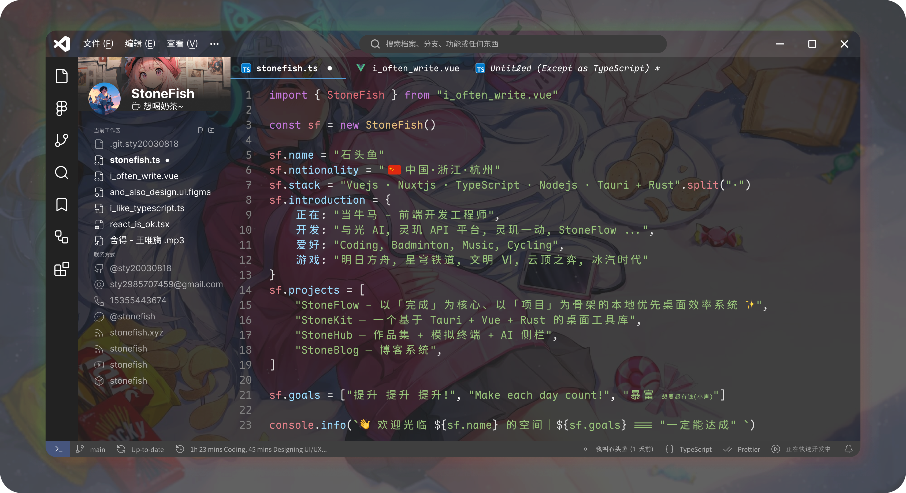

<div align="center">

<!--  -->



<p>
  <a href="https://github.com/sty20030818"></a>
  <a href="https://stonefish.space"></a>
  <a href="mailto:sty2985707459@gmail.com"></a>
</p>

</div>

```bash
$ whoami
石头鱼 (StoneFish)  —  全栈工程师

$ stack
Vue · TypeScript · Nuxt · Node.js · Express · Docker · Nginx · Linux

$ focus
交付产品级 Web 应用 · 架构清晰可维护 · 体验与性能打磨
```

---

## ✅ 简介

我是一名全栈工程师，偏好 **“能上线、能维护、能扩展”** 的工程方案。

- **全栈交付**：页面 / 接口 / 数据 / 部署，一条链路打通
- **工程质量**：规范化、组件化、可复用、可扩展
- **体验与性能**：交互细节、加载速度、稳定性（日志/监控可持续演进）

---

## 🔭 我正在做

- 我正在打造：**StoneFlow**（本地优先的代办清单）
- 我持续迭代：**StoneHub**（个人网站 / 作品集）+ **模拟终端** + **AI 侧栏**
- 我记录沉淀：**StoneBlog**（个人博客系统）

---

## 🚀 精选项目

### ✨ StoneFlow · **以「完成」为核心、以「项目」为骨架** 的本地优先桌面效率系统

> **Task** 是行动，**Project** 是叙事，**Finish List** 是你走过的路。

- 🎯 **完成清单驱动 (Finish
  List)**：把“完成过”变成可回顾的资产，而不是一次性事件
- 🧭 **项目骨架 (Space / Project / Task)**：长期目标有结构，阶段推进更有掌控感
- 🗂️ **像 IDE 一样顺手的交互**：抽屉式 Inspector、拖拽排序、批量编辑、零摩擦流转
- ⌨️ **高密度快捷键 + 命令面板**：不离开键盘也能完成大多数操作
- 🔒 **本地优先 + 数据可控**：SQLite 本地存储，速度快、离线可用、隐私更安心
- 🦀 **Rust 后端更可靠**：核心数据变更通过 Rust 层统一收口，减少“写坏数据”的概率

> 我们把任务管理当成一个“行为档案系统”，未来会用日志和分析把你从“忙”带到“变强”。

- Landing Page: [https://landing.stonefish.space](https://landing.stonefish.space)

---

### 🧩 StoneHub · Nuxt — 个人网站 / 作品集

> 页面包含：**首页 / 项目 / 博客 / 此刻 / 关于我**
> 内置 **模拟终端** + **AI 侧栏**：把展示做成“可交互的产品体验”

- `亮点:` SSR/SEO · 组件化设计 · 信息架构 · 交互细节打磨
- repo: [https://github.com/sty20030818/stonehub](https://github.com/sty20030818/stonehub)

---

### ✍️ StoneBlog · Nuxt — 个人博客系统

> 长期内容沉淀：结构清晰、可持续扩展、维护友好

- `亮点:` 内容组织 · 主题结构可扩展 · 性能与可读性
- repo: [https://github.com/sty20030818/stonefish.blog](https://github.com/sty20030818/stonefish.blog)

---

### 🖥️ StoneOS · Nuxt 4 — Web 端“OS”模拟系统

> 把 **桌面 / 窗口 / 系统交互范式** 搬到 Web：更沉浸、更有产品感

- `亮点:` 复杂状态管理 · 模块化设计 · 沉浸式交互 · 可扩展“系统组件”
- repo: [https://github.com/sty20030818/stoneOS](https://github.com/sty20030818/stoneOS)

---

### 🏸 羽毛球在线约球平台 · Vue 3 + Express — 全栈业务项目

> 前后端一体：覆盖用户流程、数据管理、接口联调与部署落地

- `亮点:` REST API 设计 · 鉴权/权限 · 业务闭环 · 可迭代架构
- repo: [https://github.com/sty20030818/Badminton-platform-frontend](https://github.com/sty20030818/Badminton-platform-frontend)
- repo: [https://github.com/sty20030818/Badminton-platform-backend](https://github.com/sty20030818/Badminton-platform-backend)

---

## 🧰 Skills

<div align="center">
  
</div>

---

## 📊 GitHub Stats

<div align="center">


</div>

---

## ⏱️ 写代码的时间

## [](https://github.com/anuraghazra/github-readme-stats)

## 🧠 做事风格

- **可读性 > 炫技**
- **稳定交付 > 追新堆栈**
- **小步迭代 > 大拆大改**
- **度量 → 优化 → 迭代**

---

## 🤝 机会

- Full-Stack / 前端方向
- 需要“能把东西做出来并做稳”的团队与项目

---

## 📫 联系方式

- Email: [sty2985707459@gmail.com](mailto:sty2985707459@gmail.com)
- Website: [https://stonefish.space](https://stonefish.space)

<details>
  <summary><b>⚙️ 更多</b></summary>

- 我关注：架构清晰、交付效率、长期可维护性。
- 我喜欢做：强交互体验（Terminal / OS 风 UI）、内容平台、全栈产品。

</details>
